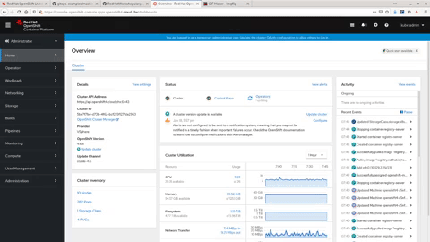
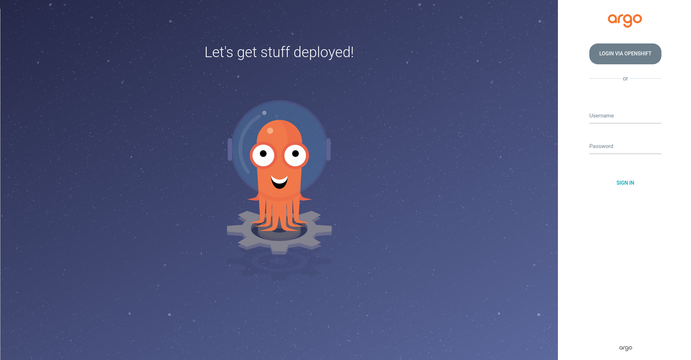
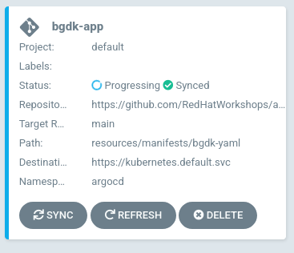
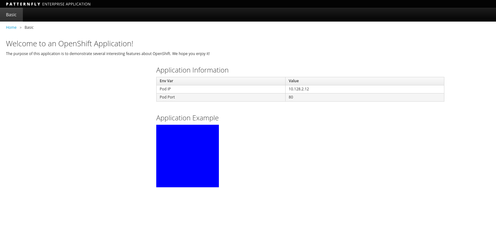

# Getting Started Guide With ArgoCD

This guide helps you get started with ArgoCD. This is a simple guide
that takes you through the following steps:

* [Installing the ArgoCD Operator](#installing-the-argocd-operator)
* [Installing an ArgoCD Instance](#installing-an-argocd-instance)
* [Deploying A Sample Application](#deploying-a-sample-application)

The idea of this guide is that it should work on ANY OpenShift 4.6+
cluster. So you'll need an OpenShift cluster or CRC. You will also
need the `oc` cli utility.


> :heavy_exclamation_mark: **NOTE** This won't work on a disconnected cluster.

# Installing the ArgoCD Operator

The easiest way to install the ArgoCD Operator is via the OpenShift UI.



To install it via the UI you simply...

* Click on `Operators` drop down on the leftside navigation.
* Click on `OperatorHub`
* In the search box type `argocd`.
* Select the `Argo CD` card (Note, that, this is a community supported operator).
* Click on `Continue` on the 'Show Community Operator' information notification.
* Click `Install` on the `Argo CD` installation dialog.

Another way to do this is to use the manifest directly. You can use the
resources in this repo to install the ArgoCD Operator:

```shell
oc apply -k https://github.com/RedHatWorkshops/argocd-getting-started/resources/manifests/argocd-operator-install
```

This uses [kustomize](https://kustomize.io/) to load the manifests needed
to install the Argo CD Operators. These 3 are:

* [argocd-namespace.yaml](resources/manifests/argocd-operator-install/argocd-namespace.yaml)
* [argocd-operatorgroup.yaml](resources/manifests/argocd-operator-install/argocd-operatorgroup.yaml)
* [argocd-subscription.yaml](resources/manifests/argocd-operator-install/argocd-subscription.yaml)

> :bulb: **NOTE**: You don't have to use `kustomize`. You can `oc apply -f` these files individually

Once you've installed the Operator, you can now deplay an ArgoCD Instance.

# Installing an ArgoCD Instance

Once the Operator is installed, we need to tell it to deploy an instance
of ArgoCD. First you need to make sure ArgoCD has the ability to
administer the cluster.

First, you create a `ClusterRoleBinding` that gives the `ServiceAccount`
named `argocd-application-controller`, the `cluster-admin`
`ClusterRole`. This allows ArgoCD to manage the cluster.

```yaml
kind: ClusterRoleBinding
apiVersion: rbac.authorization.k8s.io/v1
metadata:
  name: argocd-application-controller-cluster-admin
subjects:
  - kind: ServiceAccount
    name: argocd-application-controller
    namespace: argocd
roleRef:
  apiGroup: rbac.authorization.k8s.io
  kind: ClusterRole
  name: cluster-admin
```


Now you can install ArgoCD using the following manifest:

```yaml
apiVersion: argoproj.io/v1alpha1
kind: ArgoCD
metadata:
  name: argocd
  namespace: argocd
spec:
  server:
    route:
      enabled: true
  dex:
    openShiftOAuth: true
    image: quay.io/redhat-cop/dex
    version: v2.22.0-openshift
  resourceCustomizations: |
    route.openshift.io/Route:
      ignoreDifferences: |
        jsonPointers:
        - /spec/host
  rbac:
    defaultPolicy: ''
    policy: |
      g, system:cluster-admins, role:admin
    scopes: '[groups]'
  initialRepositories: |
    - name:  argocd-getting-started
      type: git
      url: https://github.com/RedHatWorkshops/argocd-getting-started
```

This manifest does some customization to work with OpenShift:

* Creates the ArgoCD instance in the `argocd` namespace.
* Creates a route (under: `.spec.server.route.enabled`)
* Uses Dex to allow the mapping of OpenShift groups to ArgoCD groups (under: `.spec.dex`)
* RBAC mapping of the `system:cluster-admins` OCP group to `role:admin` role in ArgoCD (under: `.spec.rbac`)
* Initialize this repo for use later (under: `.spec.initialRepositories`)

For more info, please see [the official ArgoCD Operator
Doc](https://argocd-operator.readthedocs.io/en/latest/reference/argocd/)

You can install both of these [using this
repo](resources/manifests/argocd-instance) by running:

```shell
oc apply -k https://github.com/RedHatWorkshops/argocd-getting-started/resources/manifests/argocd-instance
```

> :bulb: You can **optionally** apply the [argocd-instance.yaml](resources/manifests/argocd-instance/argocd-instance.yaml) and [argocd-cluster-role.yaml ](resources/manifests/argocd-instance/argocd-cluster-role.yaml ) one at a time.

Once applied, you should see the following in the `argocd` namespace,
when you run the `oc get pods -n argocd` command:

```
$ oc get pods -n argocd
NAME                                             READY   STATUS    RESTARTS   AGE
argocd-application-controller-774cc495f6-wd58h   1/1     Running   0          80m
argocd-dex-server-5c549895f9-6srhw               1/1     Running   0          80m
argocd-operator-67dbb7db5f-p7cbg                 1/1     Running   0          81m
argocd-redis-6f7cfddbcb-c5kd5                    1/1     Running   0          80m
argocd-repo-server-5454d6c459-sltk2              1/1     Running   0          80m
argocd-server-5d998f7668-qn62f                   1/1     Running   0          80m
```

It may  take a while for these to rollout so you can wait for this by running:

```
oc rollout status deployment argocd-operator -n argocd && oc rollout status deployment argocd-server -n argocd
```

Once installed, get the route for the ArgoCD UI:

```shell
oc get route argocd-server -n argocd -o jsonpath='{.spec.host}{"\n"}'
```

You should be presented with this.



Go ahead and click `LOGIN VIA OPENSHIFT`, and login as `kubeadmin`
(or a user that has the `cluster-admin` role).

You should see this screen:


# Deploying A Sample Application

In [this repo](resources/manifests/bgdk-yaml), we have some manifesets
that you can use to test. This is a simple app that includes:

* [A Namespace](resources/manifests/bgdk-yaml/bgd-namespace.yaml)
* [A Deployment](resources/manifests/bgdk-yaml/bgd-deployment.yaml)
* [A Service](resources/manifests/bgdk-yaml/bgd-svc.yaml)
* [A Route](resources/manifests/bgdk-yaml/bgd-route.yaml)

Collectively, this is known as an `Application` within ArgoCD. Therefore,
you must define it as such in order to apply these manifest in your
cluster.

Here is the `Application` manifest we are going to use:

```yaml
apiVersion: argoproj.io/v1alpha1
kind: Application
metadata:
  name: bgdk-app
  namespace: argocd
spec:
  destination:
    namespace: argocd
    server: https://kubernetes.default.svc
  project: default
  source:
    path: resources/manifests/bgdk-yaml
    repoURL: https://github.com/RedHatWorkshops/argocd-getting-started
    targetRevision: main
  syncPolicy:
    automated:
      prune: true
      selfHeal: true
  sync:
    comparedTo:
      destination:
        namespace: argocd
        server: https://kubernetes.default.svc
      source:
        path: resources/manifests/bgdk-yaml
        repoURL: https://github.com/RedHatWorkshops/argocd-getting-started
        targetRevision: main
```

Let's break this down a bit.

* ArgoCD's concept of a `Project` is different than OpenShift's. Here you're installing the application in ArgoCD's `default` project (`.spec.project`). **NOT** OpenShift's `default` project.
* The destination server is the server we installed ArgoCD on (noted as `.spec.destination.server`).
* The manifest repo where the YAML resides and the path to look for the YAML is under `.spec.source`.
* The `.spec.syncPolicy` is set to automatically sync the repo.
* The last section `.spec.sync` just says what are you comparing the repo to. (Basically "Compare the running config to the desired config")

The `Application` CR (`CustomResource`) can be applied using [this repo](resources/manifests/bgdk-app) by running:

```shell
oc apply -k https://github.com/RedHatWorkshops/argocd-getting-started/resources/manifests/bgdk-app
```

This should create the `bgdk-app` in the ArgoCD UI.



Clicking on this takes you to the overview page. You may see it as still progressing or full synced. 


> :heavy_exclamation_mark: **NOTE**: You may have to click on `show hidden resources` on this page to see it all

At this point the application should be up and running. You can see
all the resources created with the `oc get pods,svc,route -n bgd`
command. The output should look like this:

```
$ oc get pods,svc,route -n bgd
NAME                       READY   STATUS    RESTARTS   AGE
pod/bgd-788cb756f7-kz448   1/1     Running   0          10m

NAME          TYPE        CLUSTER-IP       EXTERNAL-IP   PORT(S)    AGE
service/bgd   ClusterIP   172.30.111.118   <none>        8080/TCP   10m

NAME                           HOST/PORT                                PATH   SERVICES   PORT   TERMINATION   WILDCARD
route.route.openshift.io/bgd   bgd-bgd.apps.example.com          bgd        8080                 None
```

Your output will be slightly different.

Visit your application by running the following to get the URL:

```shell
oc get route bgd -n bgd -o jsonpath='{.spec.host}{"\n"}'
```

Your application should look like this.



Let's introduce a change! Patch the live manifest to change the color
of the box from blue to green:

```shell
oc -n bgd patch deploy/bgd --type='json' \
-p='[{"op": "replace", "path": "/spec/template/spec/containers/0/env/0/value", "value":"green"}]'
```

If you quickly (I'm not kidding, you have to be lightning fast or you'll
miss it) look at the screen you'll see it out of sync:


But ArgoCD sees that difference and changes it back to the desired
state. Preventing drift.


> :bulb: **NOTE**: If you're having touble catching the sync. Run your browser window and terminal window side-by-side. This is a good thing, that Argo acts so quickly. :smiley:

# Conclusion

As you can see, you can use ArgoCD to deploy you application and hinder
platform drift. This isn't only applicable to applications, but to other
cluster resources as well (e.g MachineSets, Authentication, AutoScaling,
etc).

This was a smiple demo that should get you familiar with using ArgoCD. If
you'd like to dip your toes in a little more advanced topics, feel free
to take a look at one of these modules:

* [Working with Kustomize](resources/docs/kustomize.md)
* [Syncwaves and Hooks](resources/docs/syncwaves-and-hooks.md) * **Coming Soon** *

There are more demos and videos that you can find on
[demo.openshift.com](https://demo.openshift.com/en/dev/argocd/)
